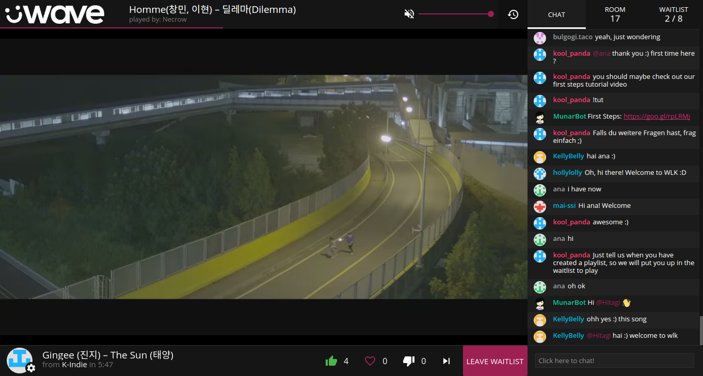

# u-wave-web

Web client for [üWave].



## Dependencies

For running in the browser: something modern. The aim is to support ~IE10+ and
other modern browsers (recent Chromes and Firefoxes, at least). If you use
something reasonably recent and üWave doesn't work, [file a bug]!

For development: Node versions >=4 and NPM 3.x.

## Getting Things Working

üWave isn't yet on NPM, so you have to do a little bit of manual setup.

First, clone the [u-wave-core] and [u-wave-api-v1] repositories. In both
directories, run `npm link`:

```bash
cd ./u-wave-core
npm link

cd ../u-wave-api-v1
npm link
```

The `npm link` command will create a symlink to the module in the global modules
folder. Now, you can create symlinks to the global modules folder inside the
`u-wave-web` folder:

```bash
cd ../u-wave-web
npm link u-wave-core u-wave-api-v1
# and install web client dependencies:
npm install
```

…and now you should be good to go!

## Building

The build system is based on Gulp. The most important tasks are aliased as npm
scripts:

```bash
npm install
# to build the client
npm run build
# to build the client for production environments: (minified, without
# development tools and such)
npm run build -- --minify
# to build the client, watch for changes, and enable live-reload in the browser
npm run watch
# to serve the client on localhost:6041:
npm run serve
```

See the [Gulp tasks documentation] for more.

## License

The üWave web client is licensed under the [MIT] license.

The default [mention sound file] comes from a [Sonics.io] pack and is under the
[Sonics.io License].

[üWave]: https://u-wave.github.io
[u-wave-core]: https://github.com/u-wave/u-wave-core
[u-wave-api-v1]: https://github.com/u-wave/u-wave-api-v1

[file a bug]: https://github.com/u-wave/u-wave-web/issues
[Gulp tasks documentation]: ./tasks/#readme

[MIT]: ./LICENSE
[mention sound file]: ./assets/audio/mention.opus
[Sonics.io]: http://sonics.io
[Sonics.io License]: http://sonics.io/license
